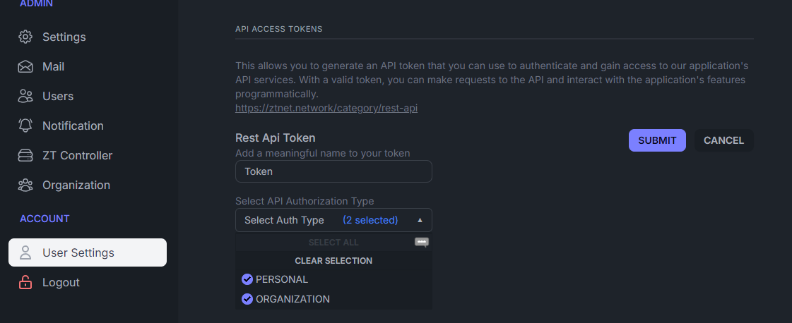

# ZTNet DNS Server

This project aims to provide a DNS server for a specific network in zerotier. It uses `coredns` as the DNS server and ZTNet's API to get the list of devices in the network and assign them in a zone file.

## Warning

> This project is only designed to work with ZTNet API and inside a docker container, if you have other use cases like running it on my.zerotier.com, you can adapt a few things like `scripts/zt2zone.sh` script and get it working for you. Or to run without docker container you can use the same script, run it with crontab or something and use the zonefile however you like.

## Deployment

The deployment is done using docker. You can run the following service on any of your server or next to your ZTNet instance.

```yaml
services:
  dns:
    image: duoquote/ztnet-coredns:latest
    container_name: ztnet-dns
    restart: unless-stopped
    devices:
      - /dev/net/tun # Required
    cap_add:
      - NET_ADMIN # Required
    environment:
      # ORG_ID: <YOUR_ORG_ID> # Optional
      NETWORK_ID: <YOUR_NETWORK_ID>
      ZTNET_API_HOST: https://<YOUR_ZTNET_API_HOST>
      ZTNET_API_TOKEN: <YOUR_ZTNET_API_TOKEN>
      DNS_DOMAIN: next.vpn
    depends_on:
     - ztnet
    volumes:
     - dns:/var/lib/zerotier-one
    networks:
      - dns-network

volumes:
  dns:

dns-network:
  driver: bridge
  ipam:
    driver: default
    config:
      - subnet: 172.13.255.0/29
```

After running the service with `docker compose up -d` open a shell in the container and join your network.

```bash
docker exec -it ztnet-dns bash

zerotier-cli join <NETWORK_ID>
```

### Environment Variables

- `ORG_ID` - The organization id in ZTNet network if the network you select is in a organization. **Optional**.
- `NETWORK_ID` - The id of the network. **Required**.
- `ZTNET_API_HOST` - The address of the ZTNet Web Interface, it can be an IP address too. Example: `https://xxx.zerotier.tld`, `http://x.x.x.x`. **Required**.
- `ZTNET_API_TOKEN` - The API token from ZTNet Interface. **Required**.
- `DNS_DOMAIN` - The domain name to use for the DNS server. Default: `zt.vpn` (e.g. `desktoppc.zt.vpn`). **Optional**.


### How to obtain the API Token

Go to your ZTNet Web Interface and click on the `User Settings` on left side menu. Then go to the `API ACCESS TOKENS` section and create a new token.

